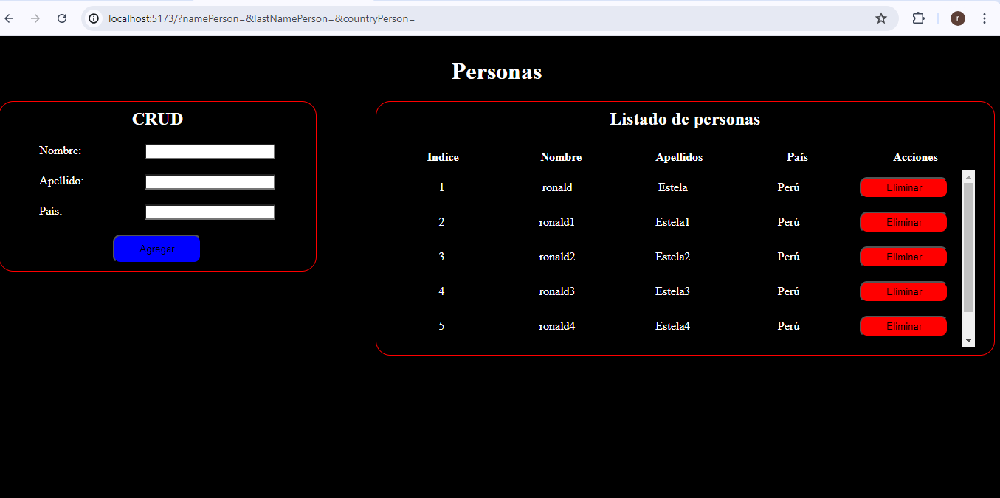

# CRUD App

Este es un proyecto de aplicación CRUD (Crear, Leer y Eliminar) que permite registrar el nombre, apellido y país de una persona y mostrar esta información en una tabla. La aplicación incluye validaciones para asegurarse de que no queden campos en blanco y un botón para eliminar registros de la tabla.

## Características

- Formulario para registrar el nombre, apellido y país de una persona.
- Validación de formulario para evitar campos en blanco.
- Visualización de los registros en una tabla.
- Botón de eliminar para quitar registros de la tabla.
- Uso de `axios` para realizar peticiones HTTP.
- Uso de `json-server` para simular una API REST.

## Requisitos

- Node.js instalado.
- `axios` y `json-server` instalados como dependencias del proyecto.

